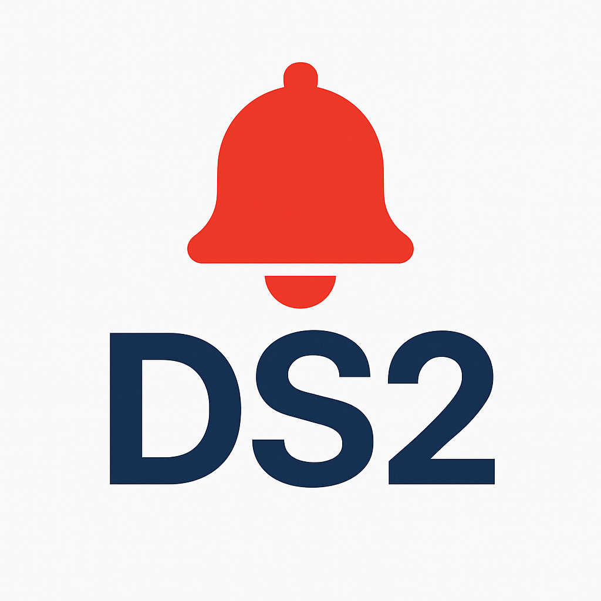

  

<h1 align="center">How I Built a Telegram Reminder Bot</h1>

<em>to Stay on Track with NTU SCTP DSAI Classes</em>

---

## 🚀 Motivation

Attendance QR codes must be scanned within a strict **30-minute window** before and after each lesson. Managing this, along with class schedules and course materials, is a hassle. I needed a solution that would:

- ⏰ **Automatically remind me of upcoming classes**
- 📚 **Provide easy access to course materials and attendance QR code info**
- 💬 **Work directly within Telegram, my go-to messaging app**

---

### 😫 Pain Point Solved

> No more digging through emails, group chats, or calendar invites.  
> **One bot, one chat, everything in one place.**

---

## 🛠️ Bot Features

- 🗓 **Class Reminders**

  - Sends alerts **30 minutes before class starts**
  - Sends reminders **at class end** to prompt attendance submission

- 📥 **Material Fetching**

  - Responds to user commands with links to course materials and GitHub resources

- ✅ **Attendance Instructions**

  - Provides module-specific attendance QR code links

- 🔁 **Daily Refresh**
  - Syncs with the latest data from the shared Google Sheet every day at **23:00 SGT**

---

---

## Tech Stack

- **Bot Framework:** `python-telegram-bot`
- **Schedule Source:** Google Sheet maintained by NTU staff (updated regularly)
- **Database:** SQLite (lightweight, easy to use)
- **Scheduler:** APScheduler (supports jobs scheduling)
- **Hosting:** Google Compute Engine Free Tier (e2-micro instance)
- **Deployment:** Systemd service

---

## Development Approach: Vibe Coding + GitHub Copilot

1. **Spec First:** I started with a clear description of the program and the libraries I wanted to use. Copilot helped refine the details.
2. **Build:** Github Copilot generates the script to handle scheduling, Google Sheet parsing, and response logic.
3. **Test and Debug:** Run tests to simulate reminders and check message flow.
4. **Deploy:** Set up the bot on a GCE VM and used `systemd` to manage its uptime and background execution.

---

## Summary

- Telegram bots are easy-to-use and user-friendly.
- GitHub Copilot makes coding easier and reduces development time when paired.
- Google Cloud is versatile. Google (Free Tier) is the most generous cloud service provider. Google Compute Engine (Free Tier) is a practical option for hosting simple bots, though the e2-micro instance is underpowered for VS Code remote usage.
